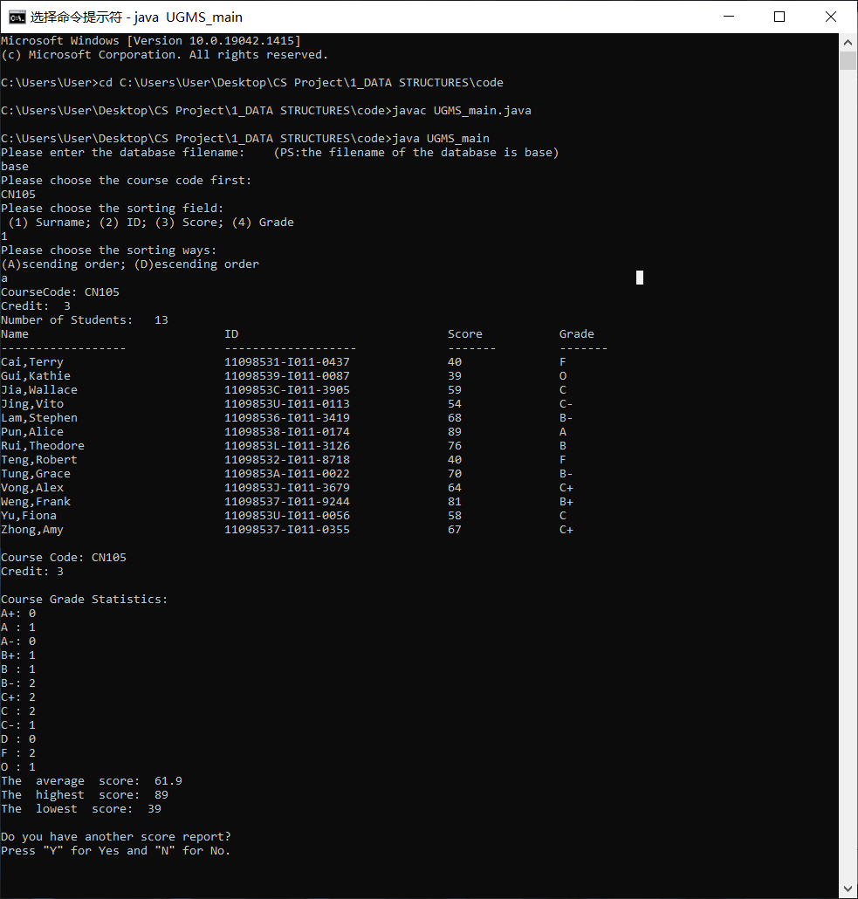

# **UGMS User Manual**

-----

>  Team: [@Hongbo Wang ](https://github.com/BOBWang1117) @Yichu Li

## **Details**

- Type: term project
- Teacher: 戴弘宁
- Computer Language: Java
- Project Name: University General Mamanagement system
- Time: 2019/10/3
- Description: Extract the basic information (.txt file) of the students, save each piece of information according to the appropriate data structure, and convert the grades of each student into the corresponding GPA. (sort algorithm: QuickSort)

## **Environment:**

- Java 1.8.0_311

## **Dependencies:** 

- None

## **Install package:**

- None

## **Run program:**

- javac UGMSTest.java
- java UGMSTest

## **Example:**

